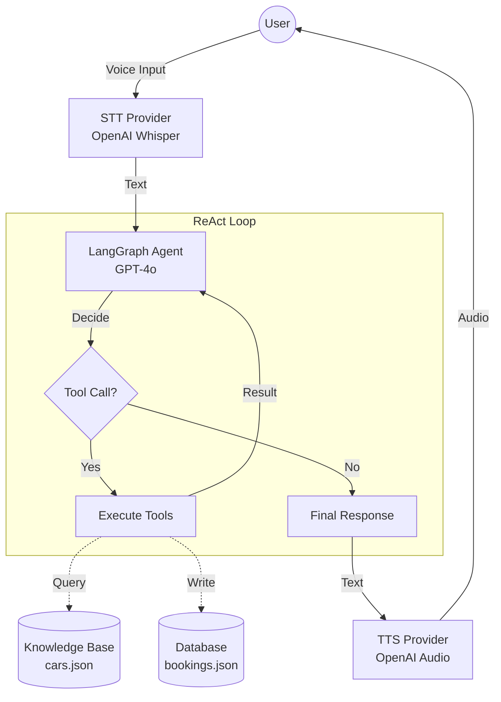

# Auto Dealership Voice Assistant

A multi-agent voice assistant for booking test drives.

## Setup

1. Install dependencies:
   ```bash
   pip install -r requirements.txt
   ```

3. **(Optional) Enable Microphone Support**:
   The default installation uses text input. To enable voice input, you need `pyaudio`.
   
   **On macOS:**
   ```bash
   brew install portaudio
   pip install pyaudio
   ```
   *If `pip install pyaudio` fails on Python 3.13, try:*
   ```bash
   pip install --no-build-isolation pyaudio
   ```

4. Run the application:
   ```bash
   python main.py
   ```

## Architecture

- **ConversationalAgent**: Orchestrates the interaction.
- **KnowledgeAgent**: Retrieves car information.
- **BookingAgent**: Manages test drive bookings.
- **Voice Layer**: Handles STT (Speech-to-Text) and TTS (Text-to-Speech).

## Agentic Flow

The system uses a **ReAct (Reason + Act)** loop powered by LangGraph:



1.  **Listen**: `STTProvider` records audio via `sounddevice` and transcribes it using **OpenAI Whisper**.
2.  **Reason**: `GraphAgent` receives the text. It uses **GPT-4o** to decide whether to call a tool or respond.
3.  **Act**:
    *   If the user asks about cars, it calls `lookup_cars`.
    *   If the user wants to book, it calls `book_test_drive`.
4.  **Persist**: Bookings are saved to `data/bookings.json`.
5.  **Speak**: The final text response is converted to high-quality audio using **OpenAI TTS** and played back.

## Usage

### Streamlit UI (Recommended)
Run the web interface with live dashboard and voice support:
```bash
streamlit run app.py
```

### CLI Mode
Run the terminal-based version:
```bash
python main.py
```
